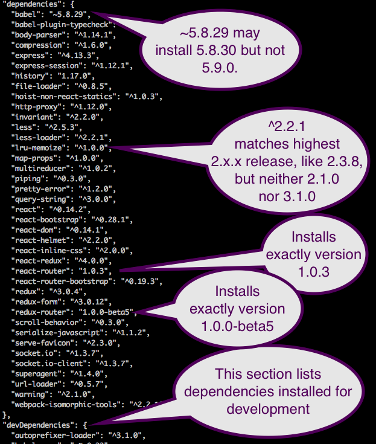
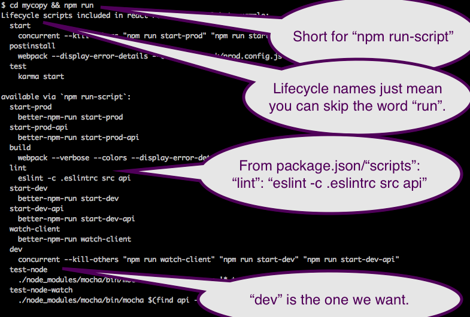
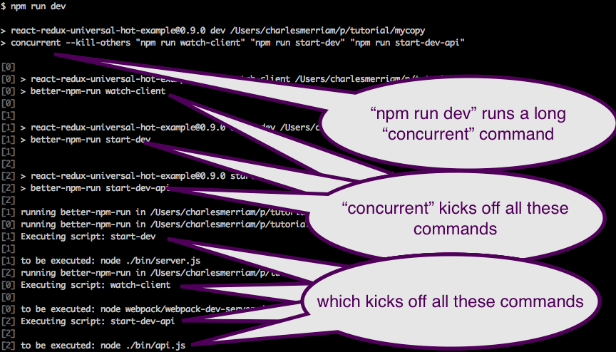
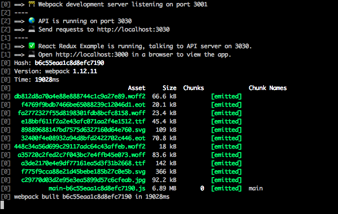
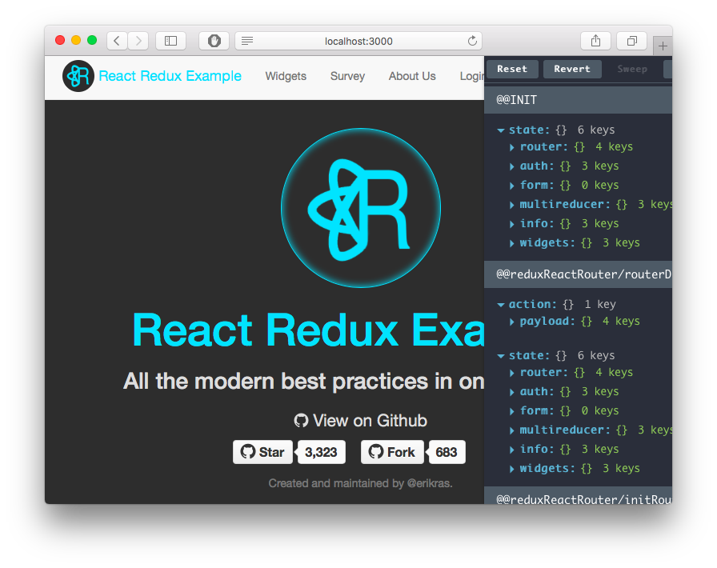

# Installing the Kit

Are you ready to install the kit and start playing with it?  No?  Good.  Let's begin.

There is no failure except when nothing is learned.

##  Clone from github

First you should clone the project from GitHub.  The easiest way is to use something like this:

This puts a copy of the whole project into your directory `mycopy`.   All the files you will change are
in this directory.   You can `rm -rf mycopy`, clone it again, and continue on.   

That's the minimum view of git, equivalent to the [xkcd view](https://xkcd.com/1597/).   Git and 
[github](https://github.com) make every manipulation and automated workflow possible but none easy.
Nothing more complex than creating new copy is necessary until contributing code to a project.

## Run npm install

Only part of the project is stored in github.  All the JavaScript libraries upon which the project depends 
are imported using npm, the node package manager.  It might be a good time to check that your version of `npm` is
up to date; OS/X users type `brew upgrade && brew update`.  

Npm installs libraries according to the [semvar](https://docs.npmjs.com/getting-started/semantic-versioning) 
minimum versions in the `dependencies` section of `package.json` file:

We also install the packages listed in the `devDependencies` section,  
[because we are installing from source](http://stackoverflow.com/questions/18875674/whats-the-difference-between-dependencies-devdependencies-and-peerdependencies).
Every package also has its own `package.json` file containing more dependencies.  Multiple versions 
of the same packages may be listed as dependencies causing copies to be installed in package subdirectories
`./node_modules/*/node_modules`, `./node_modules/*/node_modules/*/node_modules`, etc.  This accumulates 
to over 1,000 packages.

### Let's install a thousand packages:

And then you should see pages and pages of output.  Some packages suggest installing "globally" or "-g"; don't. 
Global packages install into  `/usr/local/lib/node_modules` and mix links to binaries into `/usr/local/bin`.
Local packages install into `./node_modules` with the links to binaries separate in `./node_modules/.bin`.
This provides you the to option of doing a `rm -rf node_modules && npm install` to get back to a known state.

This installation step fails some days; the kit juggles many moving parts and these packages are independently 
developed.  Some packages have [peer dependencies](https://nodejs.org/en/blog/npm/peer-dependencies/)
which end up conflicting with one another.   You can check the 
[open install issues],
run `npm install` again, or try `npm outdated && npm update`.   Errors in installation are often not caught by 
running `npm run test`.  The only way to know it works is to run it.

## Run the Development Server

First, find the command. 

Now, run it!

We run:

*  A *watch client* to trigger webpack to rebuild if we change code.
*  A *restful api server* listening on port 3030 to handle requests in JSON format.
*  A *webpack dev server* which serves your application on port 3000.  It also grabs port 3001
   for status and internal information, such as [polling middleware](http://localhost:3001/__webpack_hmr).
   You could try installing [BrowserSync](https://www.browsersync.io) to see something more interesting.
   
The second part shows these running:

You can see WebPack rebuilding static assets into `./webpack-assets.json`.  If you check the id, you
can also view it on port 3001, http://localhost:3001/dist/main-b6c55eaa1c8d8efc7190.js in this example.

Now, open up your browser to [port 3000](http://localhost:3000/):

The Redux developer bar takes up much of the screen.  Hide it with 'control-H'.

You are now running the kit on your local machine.

# The Take Away

You cloned the repository, installed all the packages, and ran the development server locally.  
You are now ready to hack on the application.
